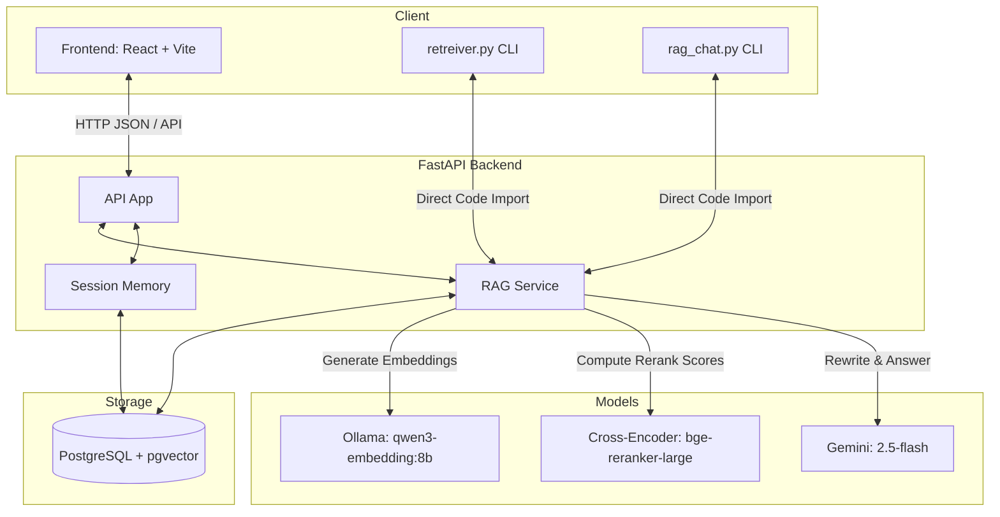
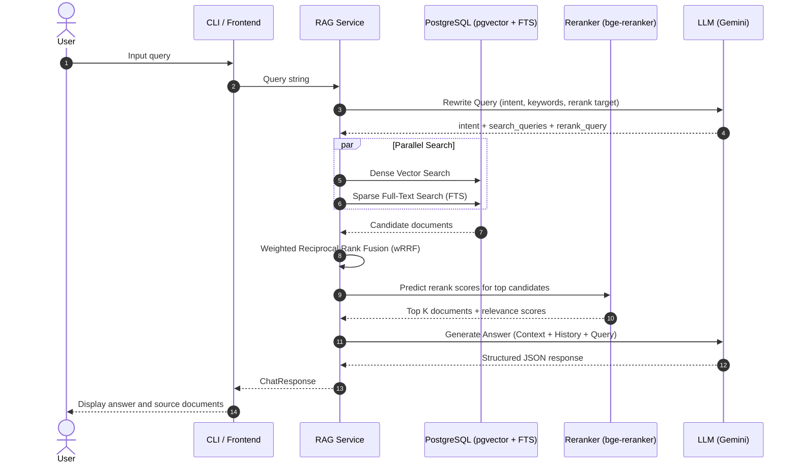

# PostgreSQL Documentation Retrieval System

A modular and clean RAG (Retrieval-Augmented Generation) pipeline for querying PostgreSQL documentation. It features hybrid retrieval (dense vector + sparse full-text search) combined with cross-encoder reranking, a React frontend, and a FastAPI backend.

---

## System Architecture



---

## RAG Pipeline Flow



---

## Tech Stack & Key Pipeline Components

1. **Semantic Chunking** — Topic-wise semantic outline chunking of the official PostgreSQL PDF documentation into semantic sections.
2. **Dense Vector Store** — Ollama `qwen3-embedding:8b` generating `1024` dimension embeddings stored in PostgreSQL using `pgvector`.
3. **Sparse Search** — GIN-indexed Postgres Full-Text Search (FTS) matching exact tokens.
4. **Weighted Reciprocal Rank Fusion (wRRF)** — Blends Dense and Sparse results using dynamic fusion weights calculated on the query intent (e.g., higher Sparse weight for code/syntax lookup, higher Vector weight for conceptual questions).
5. **Reranker** — `BAAI/bge-reranker-large` cross-encoder for compute-intensive scoring of candidates.
6. **Query Rewriter & Generator** — Gemini `2.5-flash` model executing structured multi-query expansions and answering queries using context and history.

---

## Setup & Installation

### Backend
1. Create a Python virtual environment:
   ```bash
   python -m venv venv
   source venv/bin/activate
   pip install -r backend/requirements.txt
   ```
2. Set up environment variables:
   Copy `.env.example` to `.env` in the root directory and in `backend/` directory:
   ```bash
   cp .env.example .env
   cp backend/.env.example backend/.env
   ```
   Add your database credentials and `GEMINI_API_KEY` to `backend/.env`.

### Frontend
1. Navigate to the frontend directory:
   ```bash
   cd Frontend/psql-generator
   npm install
   ```

---

## Run the Application

### 1. Ingest Documentation (One-time)
Run the chunking and embedding scripts to populate PostgreSQL:
```bash
python topicwise_chunking.py    # chunk PDF into semantic outline sections
python embed_process.py         # generate & store embeddings in PG
```

### 2. Start the Backend
Start the FastAPI server (reloads on code changes):
```bash
uvicorn backend.app.main:app --reload --port 8000
```

### 3. Start the Frontend
Run the Vite React development server:
```bash
cd Frontend/psql-generator
npm run dev
```
Open `http://localhost:5173` (or the printed port) in your browser.

### 4. Direct CLI Alternatives
Query the system interactively or inspect retrieved chunks without web servers:
```bash
python retreiver.py             # Single query retrieval & answering console
python rag_chat.py              # Multi-turn interactive chat CLI
```
